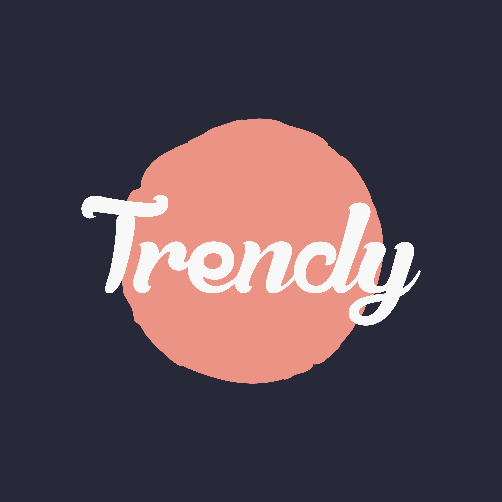

# NN4M-Project-TrendyApp

[![LinkedIn][linkedin-shield]][linkedin-url]

<!-- PROJECT LOGO -->
 

  

  <h3 align="center">Trendy App</h3>

  

    A project for NN4M by Lorenzo Masucci
     
    <a href="https://github.com/masucci/NN4M-Project-TrendyApp"><strong>Explore the docs »</strong></a>
     
     
    <a href="https://drive.google.com/file/d/1T1tnrsAsHFcNBL3KZewZvSwufP5i3Khl/view?usp=sharing">View Demo</a>
  

<!-- ABOUT THE PROJECT -->
## About The Project

![Product Name Screen Shot][product-screenshot]

In this project, I've displayed all the items in a TableView. I also added some features like, Dark mode, different labels that gave a UX/UI more affordable for the user. I also added the Reachability file (provided by Ashley Mills https://github.com/ashleymills/Reachability.swift) that gave me the possibility to inform the user, with a different screen, if there is no connection.

I added some style creating a logo with illustrator and choosing a the right color palette for the target market.

I was careful to write a clean code using refactoring after the first time. Hoping that is good for you. Thanks a lot.:smile:

### Built With
The project was entirely coded in Swift.
* [Swift](https://swift.org/)
* [UIKit](https://developer.apple.com/documentation/uikit)

### Contact me
For more information about me, here you can find some contacts:
* [Website] (https://www.lorenzomasucci.fun/)
* [Linkedin] (https://www.linkedin.com/in/lorenzo-masucci/)
* [Email](mailto:lorenzo.masucci@outlook.com)

<!-- MARKDOWN LINKS & IMAGES -->
[linkedin-shield]: https://img.shields.io/badge/-LinkedIn-black.svg?style=flat-square&logo=linkedin&colorB=555
[linkedin-url]: https://www.linkedin.com/in/lorenzo-masucci/
[product-screenshot]: images/example.png
